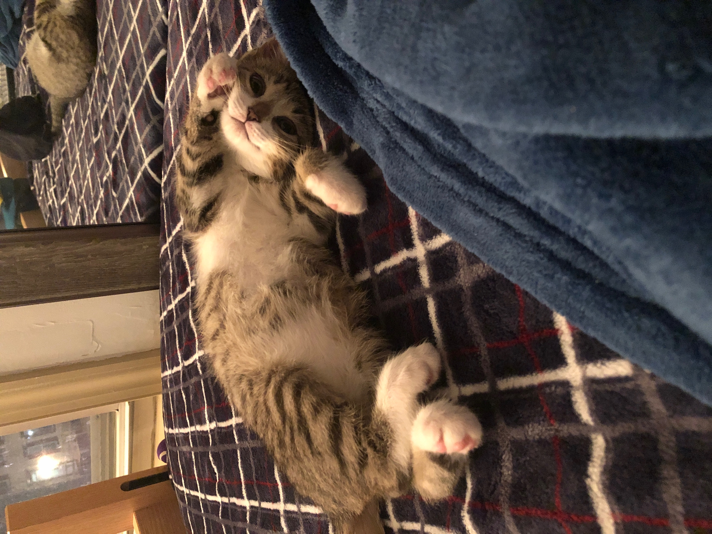
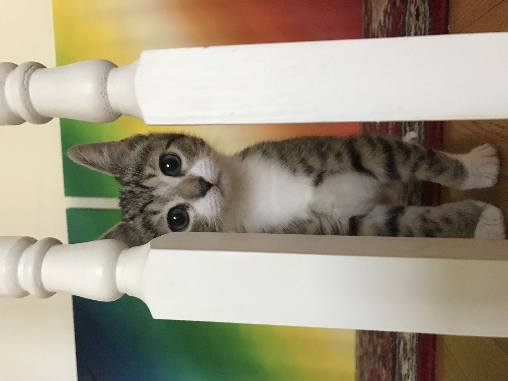
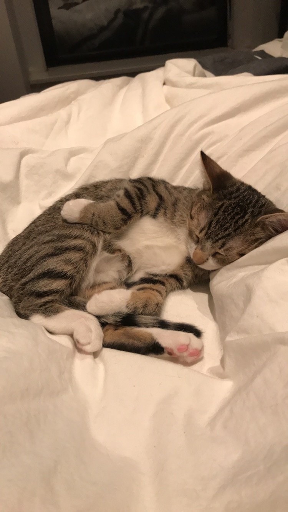
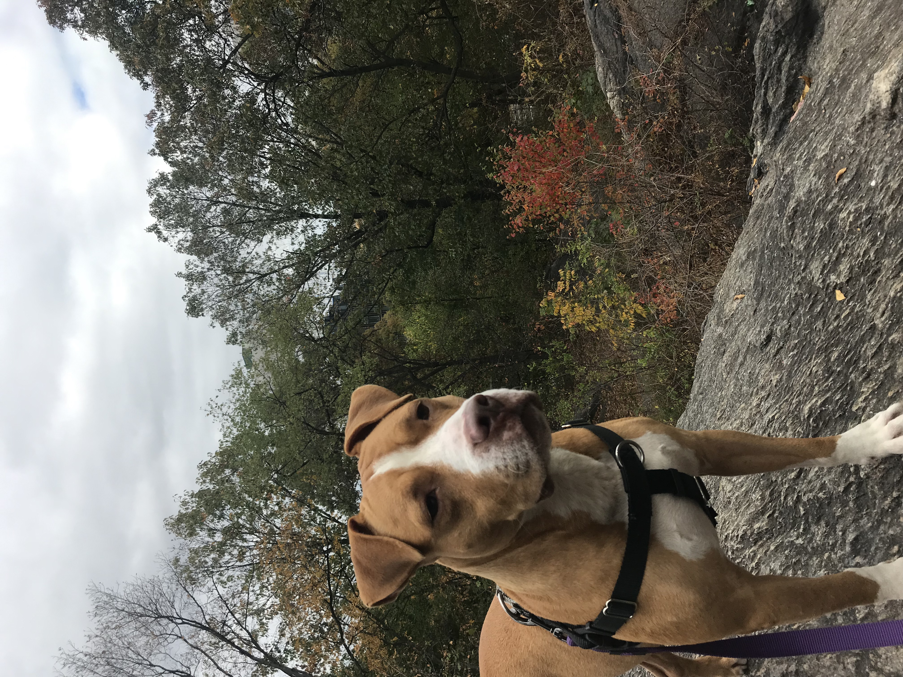
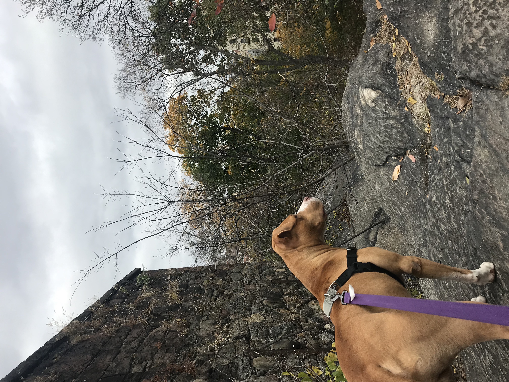
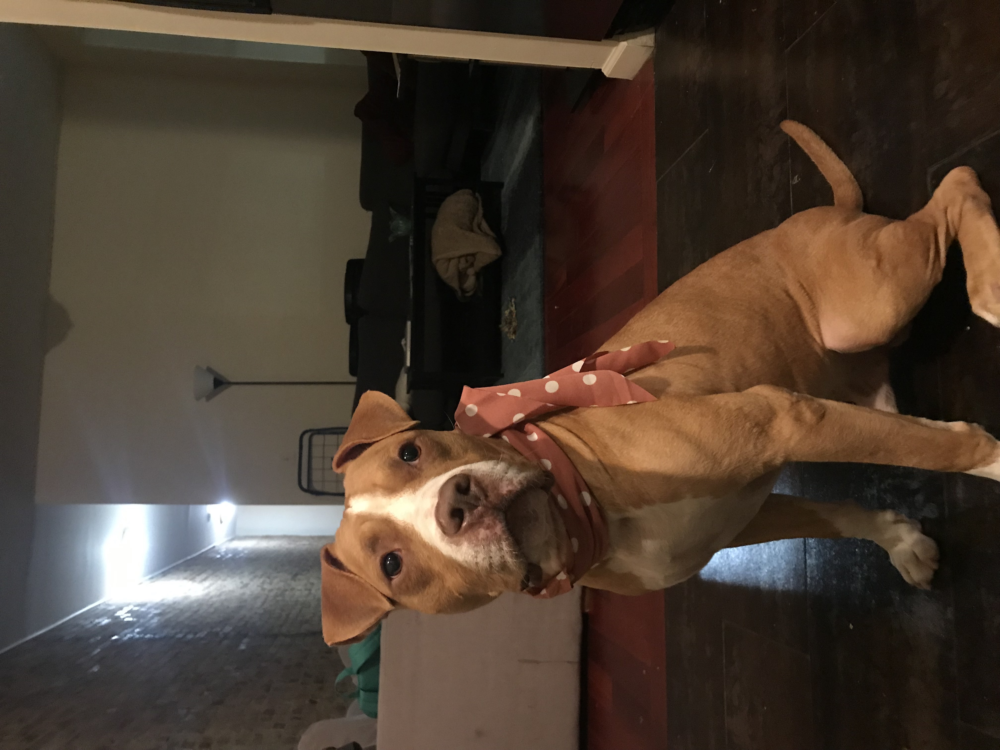

# Welcome to Amelia Zhao's website!

I'm currently a candidate for a Master's of Public Health in [Epidemiology](https://www.mailman.columbia.edu/academics/departments/epidemiology) at [Columbia University Mailman School of Public Health](https://www.mailman.columbia.edu/). I'm also currently the Medical and Operational Research Intern at [Doctors Without Borders](https://www.doctorswithoutborders.org/). 

In my current Data Science course, you can find my projects [here](https://github.com/amzhao). 

You can learn more about my academic and professional experience [here](resume.html), and on my [LinkedIn page](https://www.linkedin.com/in/amelia-zhao/).

Aside from that, I am a loving mother to my kitten, Momo, and foster dog, Archer. If you or anyone you know would be interested in adopting Archer, please reach out to me at az2356@cumc.columbia.edu. 

Here's Momo & Archer: 

